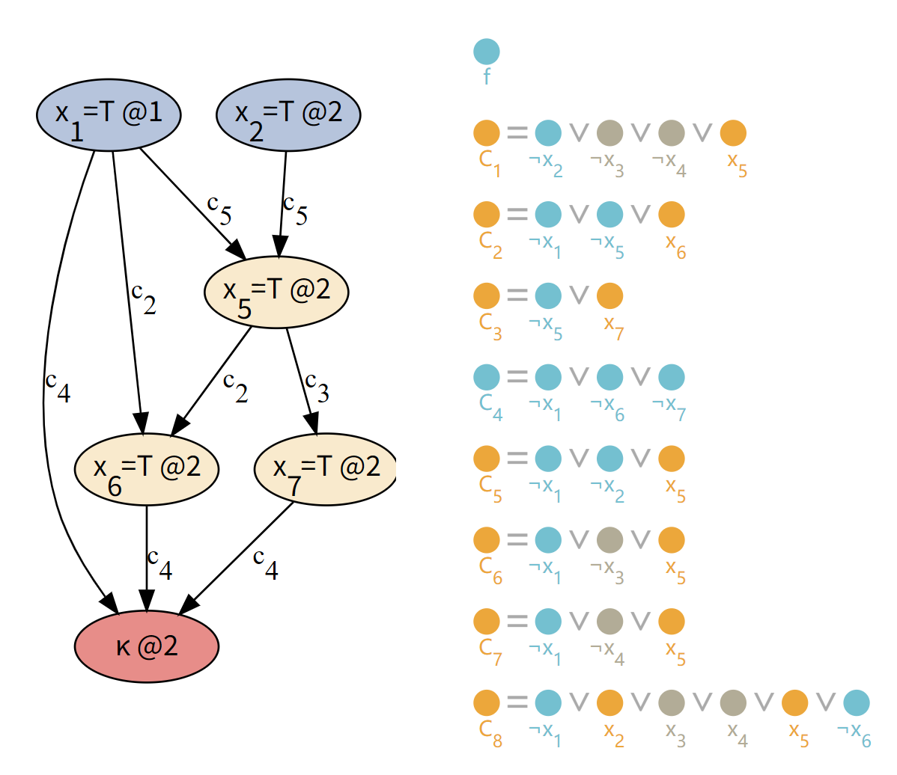

### 约束满足问题 (constraint satisfaction problem, CSP)

现有 $n$ 个变量 $x_1, \cdots, x_n$，其中 $x_i$ 在集合 $D_i$ 中取值。

欲通过给这些变量赋值，使之满足与这些变量有关的一组约束。

- 问题分为离散变量（有限 / 无穷集）、连续变量等情况。
- 约束分为一元约束（指只含一个变量）、二元约束、多元约束等。

#### 回溯搜索 (backtracking search)

考虑跑 dfs，每次只考虑一个变量，每次赋值一次就判断是否违反约束，若违反则回溯。

但这样的效率显然不会很高，一种自然的优化是改进搜索顺序：

- 选择当前约束最多 / 可能最少的变量进行赋值。
- 赋值时优先选给剩余变量留下更多可能的方案。

另一种自然的优化是随着搜索的进行缩小取值范围：

- 每进行一次赋值就相应地缩小变量的取值范围。
- 还可以进行更强的优化，见下。

#### 约束传播 (constraint propagation)

边的一致性 (consistency)：

- 称边 $i \to j$ 一致，若对 $x_i$ 的每个剩余值，$x_j$ 都存在一种赋值方式，使之不违反约束。

每次赋值后，检查被赋值变量的出边的一致性，若有不一致者则回溯；若出边对应变量的取值范围发生变化，则需递归处理。这一过程可 bfs 实现。

### 命题可满足性问题 (propositional satisfiability, SAT)

首先介绍两种命题逻辑范式：

- 合取范式 (conjunctive normal form, CNF)：形如 $\displaystyle\bigwedge_{i = 1}^k \left( \bigvee_{j = 1}^{k_i} (\neg) x_{p_{i, j}} \right)$，其中每个 $\displaystyle\bigvee_{j = 1}^{k_i} (\neg) x_{p_{i, j}}$ 称作子句。
- 析取范式 (disjunctive normal form, DNF)：形如 $\displaystyle\bigvee_{i = 1}^k \left( \bigwedge_{j = 1}^{k_i} (\neg) x_{p_{i, j}} \right)$ , 其中每个 $\displaystyle\bigwedge_{j = 1}^{k_i} x_{p_{i, j}}$ 称作子句。

下面介绍两种解决 CNF 可满足性的算法。

#### Davis-Putnam-Logemann-Loveland (DPLL) 算法

对于 CNF 的一个子句而言, 有如下情况：

- 已满足
- 无法满足
- 单字符（即单个变量或其取非）
- 其他

考虑 DFS，每次赋值后检查各子句，若无法满足则回溯，若遇单字符则进行单字符传递 (unit propagation)，即对该变量赋值使此子句为真）。

由于单字符传递引入了新的赋值，需进行布尔约束传递 (boolean constraint propagation, BCP)，即重复进行单字符传递，直至某子句无法满足或不能再进行单字符传递。

#### 矛盾引发的子句学习 (conflict-driven clause learning, CDCL) 算法

当一个赋值组合导出矛盾，在直接回溯之前，我们可以学到新的东西——即“某个赋值组合不可行”。考察下面的例子：

- 首先考虑将 $x_1$ 赋值为 $\text{true}$，用 `@1` 标记其赋值层级。此时不能进行任何 BCP。
- 接下来考虑将 $x_2$ 赋值为 $\text{true}$，用 `@2` 标记其赋值层级。此时可以进行若干次 BCP：
- (1) $x_1 \land x_2 \xRightarrow{C_5} x_5$，用 `@2` 标记其赋值层级。
- (2) $x_1 \land x_5 \xRightarrow{C_2} x_6$，用 `@2` 标记其赋值层级；$x_5 \xRightarrow{C_3} x_7$，用 `@2` 标记其赋值层级。
- (3) $x_1 \land x_6 \land x_7 \xRightarrow{C_4} \kappa$（矛盾），用 `@2` 标记其赋值层级。
- 如此，绘制出左侧的隐含图 (implication graph)。

考虑在图上画一条线，将自行赋值的 $x_1, x_2$ 和矛盾 $\kappa$ 分割。由于线的自行赋值一侧的点不能被同时满足，这便构成一个新子句。

一个恰当的新子句应当在回溯后尽量变成单子句，从而可以立刻触发 BCP。

考虑逆着 BCP 的顺序往回寻找学习子句：

- (1) 最后一次 BCP 是 $C_4$，可以学到 $\neg x_1 \lor \neg x_6 \lor \neg x_7$。
- (2) 倒数第二次 BCP 是 $C_3$，可以学到 $\neg x_1 \lor \neg x_5 \lor \neg x_6$。
- (3) 倒数第三次 BCP 是 $C_2$，可以学到 $\neg x_1 \lor \neg x_5$。
- 由于 $\neg x_1 \lor \neg x_5$ 中只有一个于第二层被推导出来的项，此即所学子句。
- 添加该子句后退回第一层继续处理即可。
