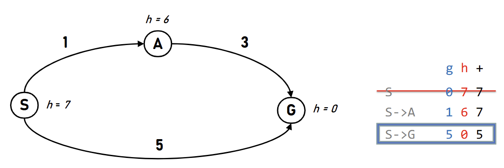

### 一致代价搜索 (uniform cost search, UCS)

考虑每次优先扩展代价最小的节点，一个节点在被扩展之前可以被持续更新。

以代价为关键字，维护待扩展点的优先队列，每次弹出代价最小者即可。

- 将搜索问题建模为图上已知源汇的最短路后，UCS 的流程与 Dijkstra 几乎一致。
- 但严格来说，前者是求到达某一目标的最小代价，后者是求到图中所有点的最短路；且两者的使用语境并不一致。~~定义学的魅力？~~

当单步代价非负，且存在一种到达目标的方案，UCS 有如下性质：

- 完备性 (completeness)：该算法一定能给出一种方案。
- 最优性 (optimality)：该算法所给出的方案一定是代价最小的。_证明将在 A* 算法的部分给出。_

但 UCS 没有利用与目标有关的信息，这引出了下面的算法。

### 树搜索与图搜索

若在搜索过程中不特殊处理重复到达的同一节点，得到的将是一棵树的结构，树上可能包含若干个同一节点。这一模式称作树搜索。

若在搜索过程中允许在找到更低代价时入队，但对每个节点只扩展一次，得到的将是一张图的结构。这一模式称作图搜索。

### A* （搜索）算法

为了利用与目标有关的信息，考虑**估算**从当前位置到目标的代价。

对于节点 $x$，设 $f(x)$ 表示从起点到 $x$ 的距离，$g(x)$ 表示从 $x$ 到终点的估计值，考虑将 $h(x) = f(x) + g(x)$ 作为关键字。此处的 $g$ 即用于“启发”搜索过程，称作**启发函数**。

- 当 $g(x) = 0$，退化为 UCS。

但任给的 $g$ 都一定能保持算法的最优性吗？不然，考虑下面这种情况：

此时从 $S$ 扩展出了 $A, G$ 两点。本来 $S \to A \to G$ 优于 $S \to G$，但 $A \to G$ 的预估代价 $6$ 大于实际代价 $3$，这使算法做出了错误的判断。

本例引出了对启发函数 $g$ 的如下要求：

- 可接受 (admisible)：$\forall x \in V, 0 \leq g(x) \leq g^*(x)$，其中 $g^*$ 为到目标的真实最小代价。

下面证明在**树搜索**情况下，当启发函数可接受，算法具有最优性：

- 只需证明：若 $A$ 为最优的目标节点、$B$ 为次优的目标节点（即 $f(A) < f(B)$），则 $A$ 先于 $B$ 出队。
- 设 $A$ 的前序节点 $x$ 和 $B$ 都在优先队列中。
- 由 $h(x) = f(x) + g(x) \leq f(x) + g^*(x) = f(A) < f(B) = h(B)$ 可知 $x$ 出队时 $B$ 必然还未出队，遂得证。

而在**图搜索**情况下，要使算法具有最优性，我们还需保证**每个节点首次出队时走的都是最优路径之一**。这需要更强的性质，即启发函数一致：

- 一致 (consistent)：$\forall (x, y, c) \in E, g(x) - g(y) \leq c$。

证明：

- $\forall (x, y, c) \in E$，已知 $g(x) \leq g(y) + c$，而 $f(y) = f(x) + c$。
- 由 $h(x) = (f(x) + c) + g(x) - c \leq f(y) + (g(y) + c) - c = h(y)$ 可知当我们沿着一条路径走，$h$ 值单调递增。
- 故当某个节点 $u$ 作为 $h_1(u)$ 出队，留在优先队列中的节点如需继续前进到达当前节点，所得 $h_2(u) \geq h_1(u)$。
- 而 $h_1(u) = f_1(u) + g(u), h_2(u) = f_2(u) + g(u)$，故 $f_1(u) \leq f_2(u)$，则首次出队时走的是最优路径之一，遂得证。
